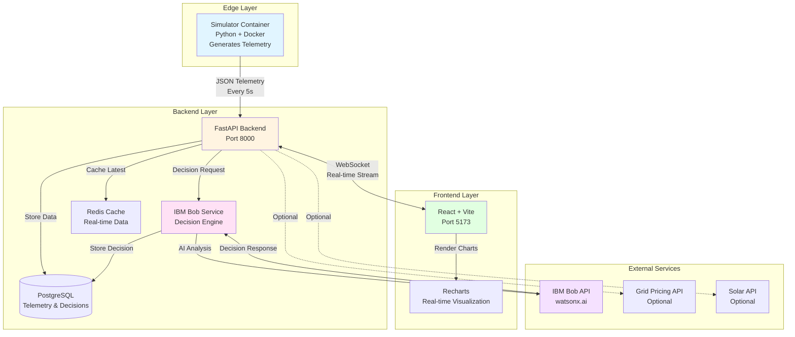
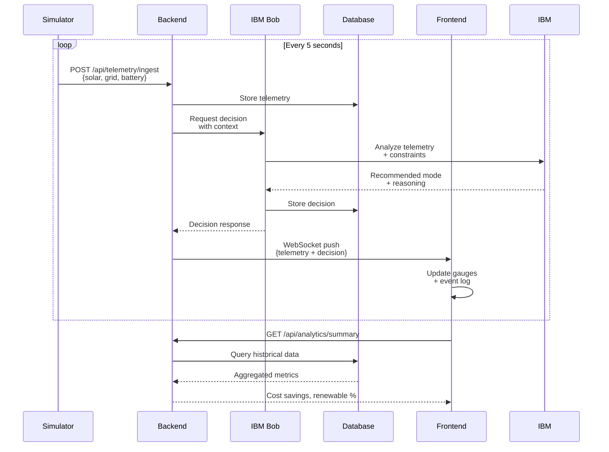
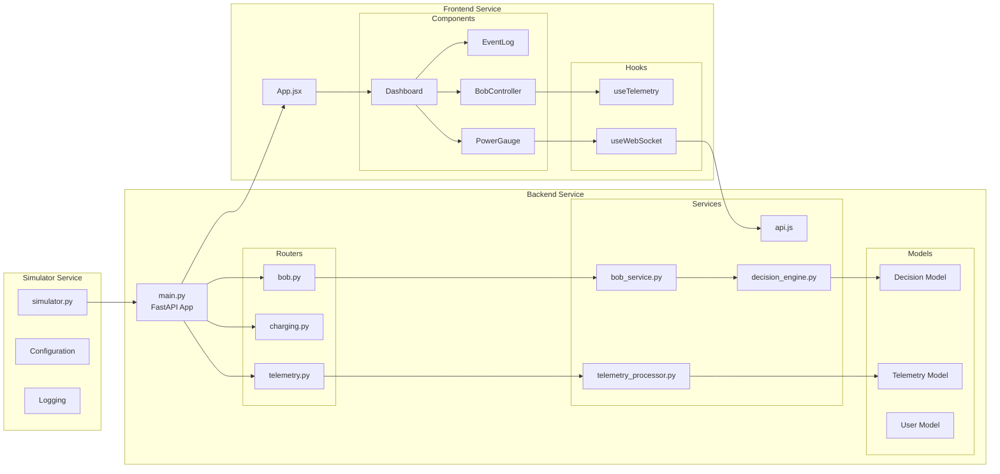
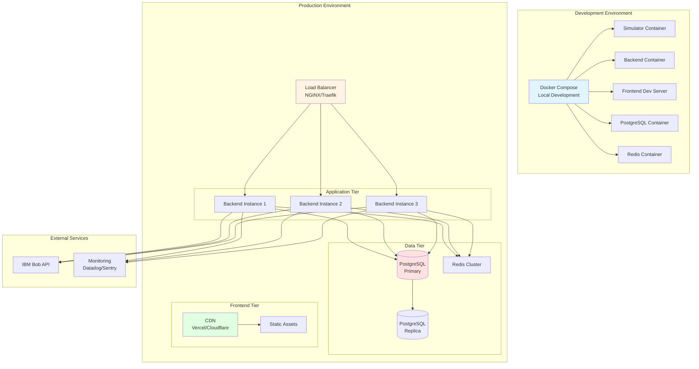
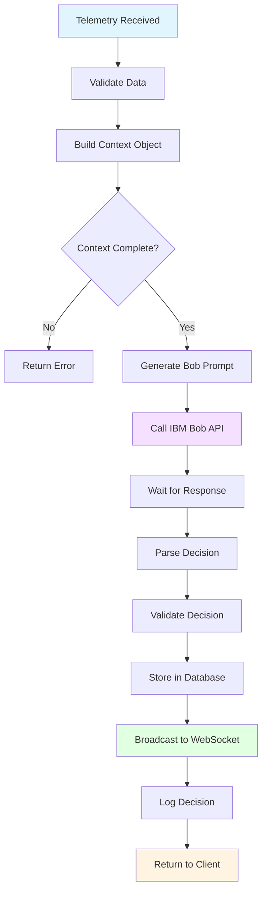
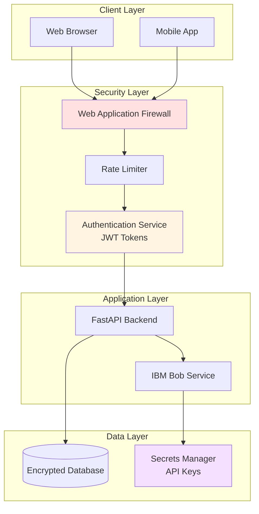
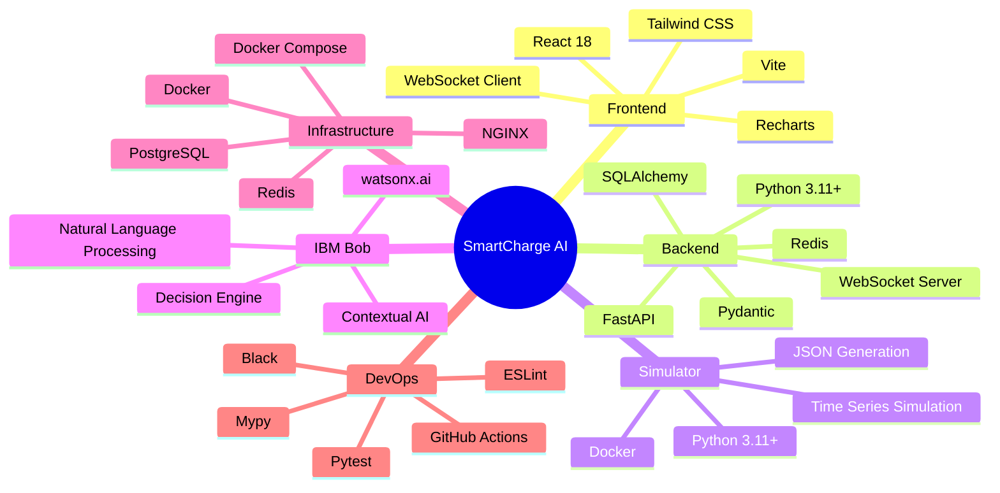

# SmartCharge AI - System Architecture

## High-Level Architecture Diagram

## Data Flow Sequence

## Component Architecture

## Deployment Architecture

## IBM Bob Integration Flow

## Security Architecture

## Technology Stack Overview

## Key Design Decisions

### 1. Microservices Architecture
- **Decision:** Separate simulator, backend, and frontend as independent services
- **Rationale:** Enables independent scaling, easier testing, and clear separation of concerns
- **Trade-off:** Increased complexity vs. better maintainability

### 2. WebSocket for Real-Time Updates
- **Decision:** Use WebSocket instead of polling for telemetry updates
- **Rationale:** Lower latency, reduced server load, better user experience
- **Trade-off:** More complex connection management vs. simpler HTTP polling

### 3. IBM Bob as Decision Engine
- **Decision:** Use IBM Bob for all charging decisions instead of rule-based logic
- **Rationale:** Contextual understanding, explainable AI, continuous learning
- **Trade-off:** API dependency vs. more intelligent decisions

### 4. Docker Containerization
- **Decision:** Containerize all services from the start
- **Rationale:** Consistent environments, easy deployment, scalability
- **Trade-off:** Initial setup complexity vs. long-term benefits

### 5. PostgreSQL for Persistence
- **Decision:** Use PostgreSQL instead of NoSQL
- **Rationale:** ACID compliance, complex queries for analytics, proven reliability
- **Trade-off:** Less flexible schema vs. better data integrity

## Performance Considerations

### Latency Targets
- **Telemetry Ingestion:** < 50ms
- **Bob Decision Request:** < 2 seconds
- **WebSocket Push:** < 100ms
- **UI Update:** < 200ms

### Scalability Targets
- **Concurrent Users:** 10,000+
- **Telemetry Events/sec:** 2,000+ (10,000 users × 1 event per 5 sec)
- **Database Size:** 100GB+ (1 year of telemetry)
- **API Throughput:** 5,000 requests/sec

### Optimization Strategies
1. **Redis Caching:** Cache latest telemetry for instant reads
2. **Database Indexing:** Index on timestamp, user_id for fast queries
3. **Connection Pooling:** Reuse database connections
4. **CDN for Frontend:** Serve static assets from edge locations
5. **Horizontal Scaling:** Add more backend instances as needed

---

*This architecture is designed for the IBM Bob Hackathon and can scale to production.*